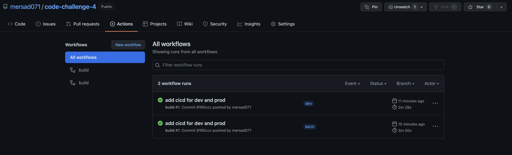

# code-challenge-4
serverless guru, code challenge

## Getting started

Application is using latest version of the serverless framework.
Install the latest version by running

```
npm i -g serverless
```

Install dependencies

```
npm i
```

Project is organized in two main folders.
Infrastructure folders contains the resources, while app folder contains the services.

We are using [serverless-compose](https://www.serverless.com/blog/serverless-framework-compose-multi-service-deployments) to deploy project.

Frontend application is built with React and is located in cc4-frontend folder.

## Deploying backend

To deploy run the following command in the root of the project.

```
sls deploy
```

If you want to deploy to a specific stage, use the following command:
  
```
sls deploy --stage prod
```

If you want to deploy to a specific region, use the following command:
  
```
sls deploy --region us-east-1
```

## CI/CD

Workflow is created using GitHub Actions. Push or merge pull request to trigger deployment. Dev branch will deploy to dev stage, while production will deploy to prod stage. In order to setup CI/CD you will need to add the following GitHub secrets: 

  - `AWS_ACCESS_KEY_ID`
  - `AWS_SECRET_ACCESS_KEY`

  
  

Frontend application is built with React and is located in cc4-frontend folder.